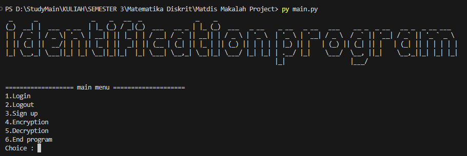

# Simple Authentication Program
> Authentication program using SHA-256 and RSA algorithm

A simple implementation utilising both SHA-256 and RSA algorithm to create a unique signature based on username and password. RSA is also used to encrypt and decrypt messages.

## Table Of Contents
* [Abstract](#abstract)
* [Repository Structure](#repository-structure)
* [Technologies Used](#technologies-used)
* [Features](#features)
* [Getting started](#getting-started)
* [Developing](#developing)
* [Screenshots](#screenshots)
* [Links](#links)
* [Licensing](#licensing)

## Abstract

## Repository Structure 
```bash
.
├─── database
│   └─── data.json
├─── doc
│   ├─── 13522075-Makalah-Matdis-2023.pdf 
│   ├─── IEEE-Template_makalah_IF2120.docx
│   └─── TugasMakalah2023.pdf
├─── screenshots
│   ├─── dec1.png
│   ├─── dec2.png
│   ├─── dec3.png
│   ├─── enc1.png
│   ├─── enc2.png
│   ├─── enc3.png
│   ├─── login_fail.png
│   ├─── login_success.png
│   ├─── main_menu.png
│   └─── signUp.png
├─── .gitignore
├─── LICENSE
├─── main.py
├─── README.md
└─── requirements.txt
```
## Technologies Used
- python
- json

## Features
* Simulate user authentication using SHA-256 and the RSA algorithm.
* Create a program that encrypts and decrypts text using the RSA algorithm.


After running those three commands, you have a variety of options, the options are as follows : <br>
1. Login
2. Logout
3. Sign up
4. Encryption
5. Decryption
6. End program

Before being able to do the main options (4-5), user either needs to login first or sign up and then login. After that, user is know able to use both encryption and decryption

## Getting started

Make sure your Python is appropriate. Try running py --v, if not found, it means your Python installation is not correct. Required version >=3.0. Install the python libraries by running the command:

```shell
pip install requirements.txt
```


## Developing
To start trying/modifying code, you need to clone the repository first
```shell
git clone https://github.com/MarvelPangondian/Simple-User-Identification-Program.git
cd Simple-User-Identification-Program
pip install requirements.txt
```
To run program :

```shell
py main.py
```

## Screenshots

<br><br>


## Links

- Repository: https://github.com/MarvelPangondian/Simple-User-Identification-Program

## Licensing
"The code in this project is licensed under MIT license."
MIT License

Copyright (c) 2023 Marvel Pangondian

Permission is hereby granted, free of charge, to any person obtaining a copy
of this software and associated documentation files (the "Software"), to deal
in the Software without restriction, including without limitation the rights
to use, copy, modify, merge, publish, distribute, sublicense, and/or sell
copies of the Software, and to permit persons to whom the Software is
furnished to do so, subject to the following conditions:

The above copyright notice and this permission notice shall be included in all
copies or substantial portions of the Software.

THE SOFTWARE IS PROVIDED "AS IS", WITHOUT WARRANTY OF ANY KIND, EXPRESS OR
IMPLIED, INCLUDING BUT NOT LIMITED TO THE WARRANTIES OF MERCHANTABILITY,
FITNESS FOR A PARTICULAR PURPOSE AND NONINFRINGEMENT. IN NO EVENT SHALL THE
AUTHORS OR COPYRIGHT HOLDERS BE LIABLE FOR ANY CLAIM, DAMAGES OR OTHER
LIABILITY, WHETHER IN AN ACTION OF CONTRACT, TORT OR OTHERWISE, ARISING FROM,
OUT OF OR IN CONNECTION WITH THE SOFTWARE OR THE USE OR OTHER DEALINGS IN THE
SOFTWARE.

